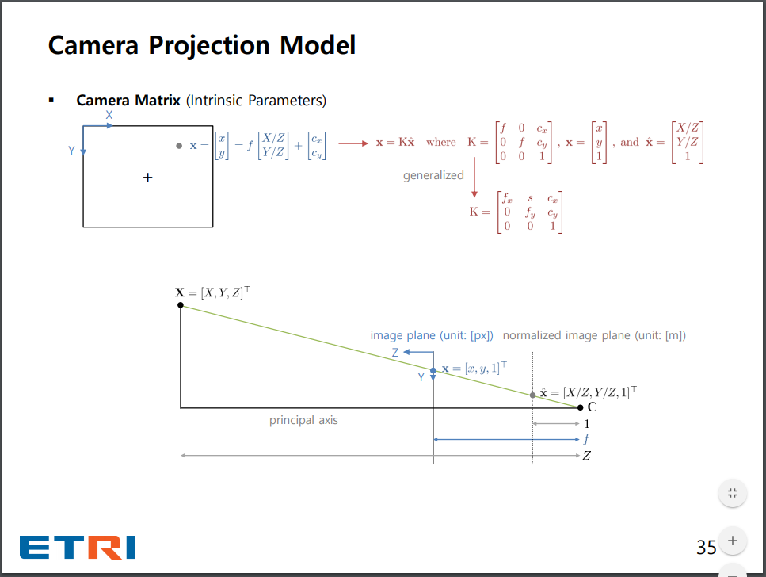
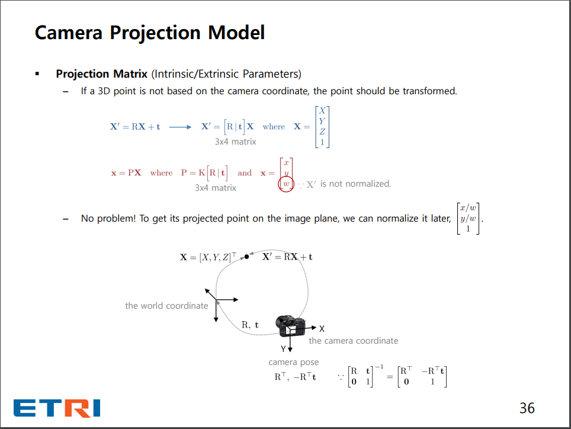
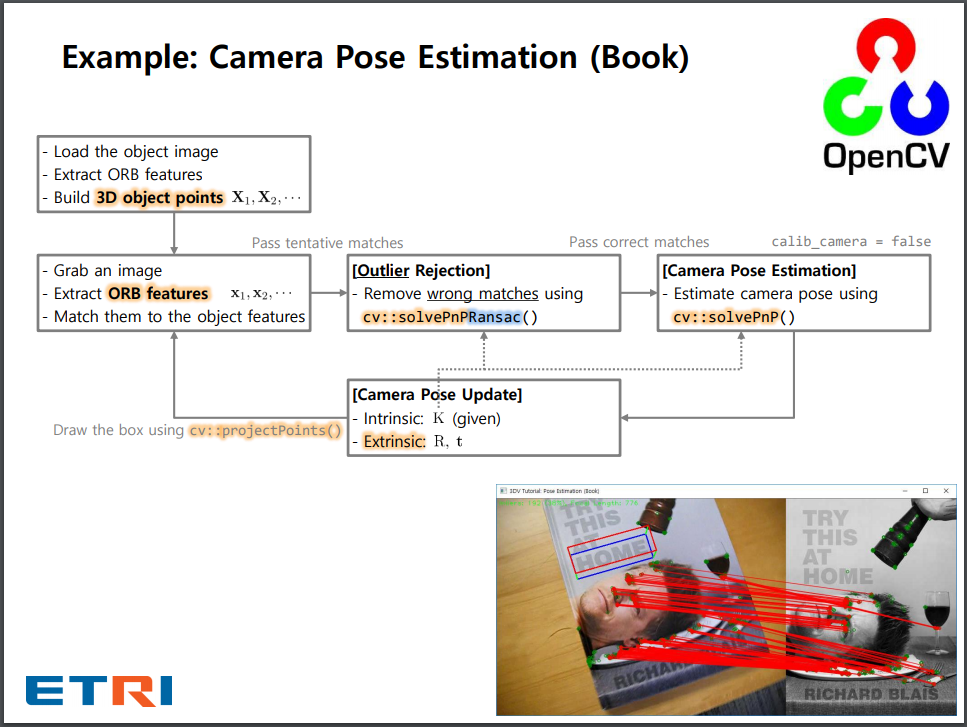
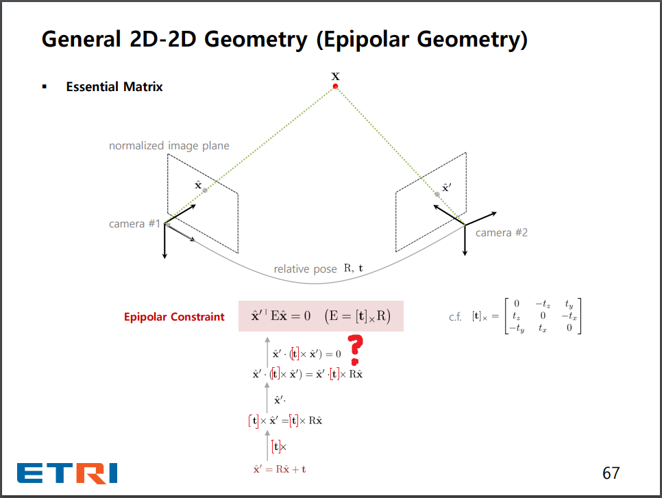
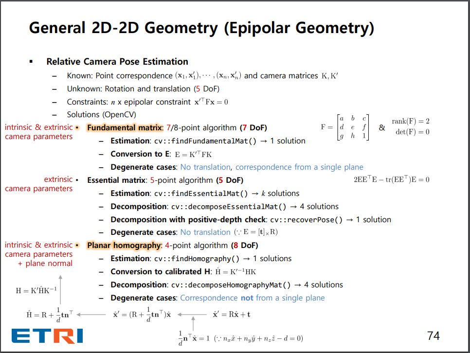
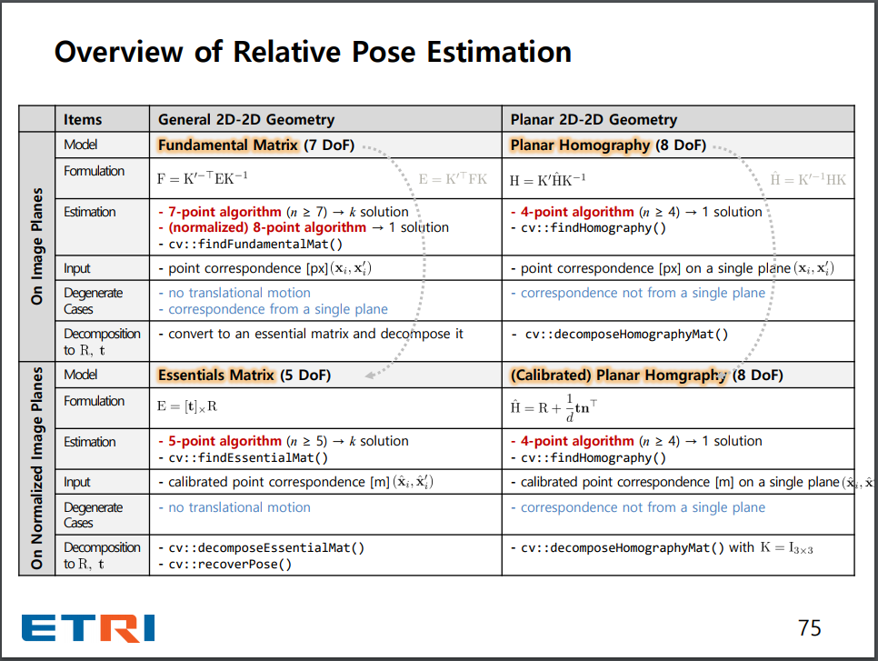

The sparse notes of [An Invitation to 3D Vision: A Tutorial for Everyone](https://github.com/sunglok/3dv_tutorial) slides and possible codes.

> A really good one.  -- MiaoDX

### Normalized image plane

It's the very first time I see the notation of `normalized image plane`, and the unit of meter somewhat explain the convert depth info to meter in [slambook example of gaoxiang](https://github.com/gaoxiang12/slambook/blob/master/ch7/pose_estimation_3d2d.cpp#L61).

### Reversed $R$ in camera coordinate (pose)

When talking about the rotation, many (not all) literatures refer to the objects moves w.r.t the camera, so there will be a reverse for the camera coordinate. (right?)

### Run PnP twice

I am not so sure of it, but run twice really make a difference?

### Q: decompose homography and the `coarse` navigation of of platform? (p60)

### Epipolar constraint in essential matrix

Not so sure of the deduction.

$E=[t]_xR$

### Epipolar line, the physical meaning?

### Degenerate cases of $F$ and $E$ and $H$

Not so sure of the $F$ -- no translation, correspondence from a single plane.

But for $E$, it is pretty clear, since $E=[t]_xR$, a $t$ of $0$ will lead to no suitable results.

### Small but somewhat complete overview of relative pose estimation

