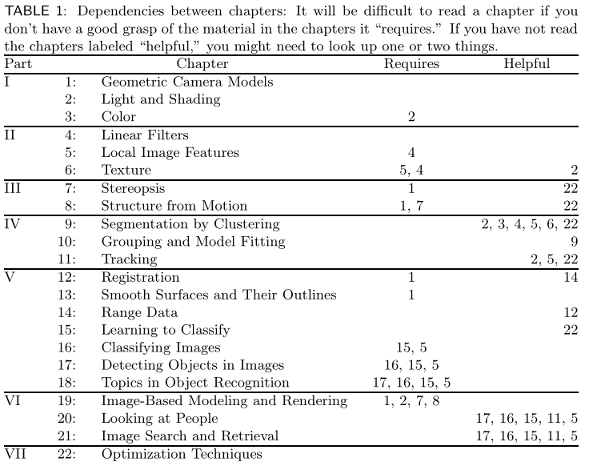

* (In our view,) Vision relies on a solid understanding of cameras and of the physical process of image formation (I.Image formation) to obtain simple inferences from individual pixel values (II.Early vision:Just one image), combine the information available in multiple images into a coherent whole (III.Early vision:Multiple images), impose some order on groups pf pixels to separate them from each other or infer shape information (IV.Mid-Level Vision), and recognize objects using geometric information or probabilistic techniques (V.High-Level Vision).

I write a program to generate the mind map of the chapter of this book, list as below:

And bigger map can be find at [mind_map_level_3](pics/Computer_vision_mindmap_level3.png) or [mind_map_all](pics/Computer_vision_mindmap_all.png), they are just too big and should be reorganized.