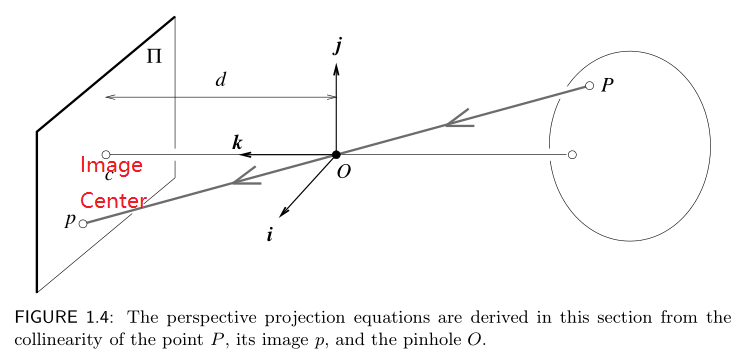
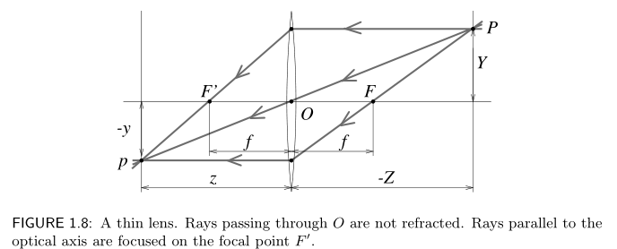
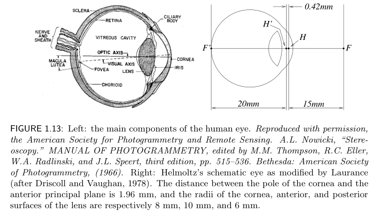

# Chapter I. Geometric Camera Models

## 1.1 Image Formation

### 1.1.1 Pinhole Perspective

Pinhole perspective (central perspective) will not strictly apply in reality, it is mathematically convenient and, despite its simplicity, it often provides
an acceptable approximation of the imaging process.


**NK:**, Figure 1.3 (b), I cannot figure out what it means.




`c` is called `image center`.

$\left\{\begin{matrix} x = \lambda X  \\ y = \lambda Y \\ d = \lambda Z  \end{matrix}\right.$
$\Leftrightarrow$
$ \lambda = \frac{x}{X} = \frac{y}{Y} = \frac{d}{Z} $

$\Leftrightarrow$

$$\left\{\begin{matrix} x = d\frac{X}{Z} \\ y = d\frac{Y}{Z}  \end{matrix}\right.$$


### 1.1.2 Weak perspective

Weak perspective (scaled orthography)

-> Go further, normalize image coordinate 

-> orthographic projection.

### 1.1.3 Camera with lenses

Reflection, refraction.

$n_{1}\sin\alpha_{1}=n_{2}\sin\alpha_{2}$

* Thin lens



* Thick lens


### 1.1.4 The Human Eye




## 1.2 Intrinsic and extrinsic parameters

All perspective equations above  is valid only when all distances are measured in the camera’s reference frame, and when image coordinates have their origin at the image center where the axis of symmetry of the camera pierces its retina.

In practice, the world and camera coordinate systems can be coordinate by some `parameters`, such as:

* the focal length of the lens
* this size of the pixels
* the position of the image center
* the position and orientation of the camera

These can be classified into two parts ([Generated by asciiflow](http://asciiflow.com/)):

``` vi 
+-------------------------------------------------------------------------+
|                                                   CS: coordinate system |
| idealized CS: used in the equations above                               |
|            +                                                            |
|            |                                                            |
|            |intrinsic params                                            |
|            |                                                            |
|            +                                                            |
|        Camera's CS  +-------------------+   fixed world CS              |
|                                                                         |
|       extrinsic params:it's position and orientation in space           |
+-------------------------------------------------------------------------+
```


### 1.2.1 Rigid transformations and homogeneous coordinates

Rigid transformation: 刚性变换

If we have two points A and B in a coordinate system, then can have a formulation:

$^{A}\mathbf{P}=\mathcal{R}^{B}\mathbf{P}+\mathbf{t}$

$^{A}\mathbf{P}$ and $^{B}\mathbf{P}$ are of $\mathbb{R}^{3}$

If we transfer these into homogeneous coordinates:

$^{A}\mathbf{P}=\mathcal{T}^{B}\mathbf{P}$, where 

$\mathcal{T}=\bigl(\begin{smallmatrix}
 \mathcal{R} & \mathbf{t}\\
 0^{T}  & 1
\end{smallmatrix}\bigr)$

$^{A}\mathbf{P}$ and $^{B}\mathbf{P}$ are of $\mathbb{R}^{4}$ now.

Rotation matrix $\mathcal{R}$ is:

* inverse = transpose 
$\mathcal{R}^{-1}=\mathcal{R}^{T}$
* determinant = 1 
$det{\mathcal{R}}=1$

When the two characters are not maintain:

$\mathcal{R}$ is arbitrary nonsingular 3*3 matrix -> *affine* transformation

$\mathcal{T}$ is arbitrary nonsingular 4*4 matrix -> *projective* transformation.