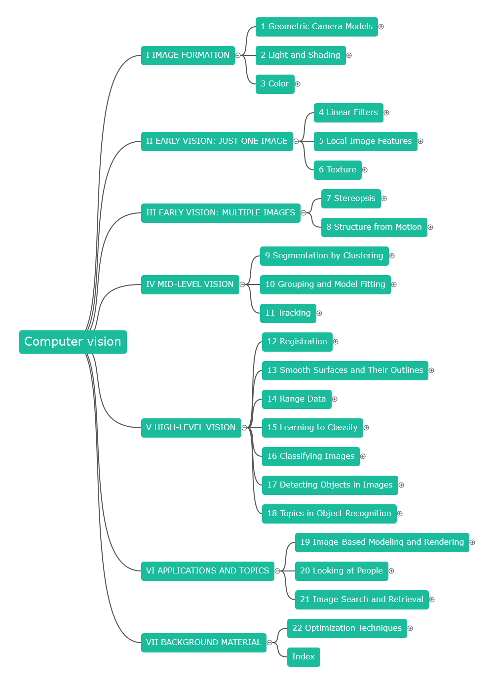

I chose this book over some other alternatives because of the chapter arrangement is so irresistible and I even wrote a program to generate the mind map of the chapter of this book:

However, by far (eight chapter reading with tons of skip content), I do not think this book is very suitable for me: the theory parts, especially the matrices operations are really hard for me.

Each and every time I want to quit, the next chapter name stopped me to do so, well, I really appreciate the author's hardworking on the chapter names (and contents in them).  :( :)

Well, that's it. Maybe I will revisit these chapters after more matrices learning.

Update, 20170614:

I read through and kind of skipped this book, even not so many apparent harvest, it seems I do have a little necessary background for computer vision stuff through this book.

However, I won't recommend this book to newbies too much since the content is somewhat old, newer technologies like ML (or latter DL) is not mentioned at all, of course, you cannot have it all, but the lack of newer tech make the state-of-the-art methods in this book less convinced.

Back to what I said before, the organization of the book is excellent, but it dose not suit me well.

That's it, move on to another one.