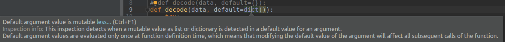

# Effective Python

## Item 2: Follow the PEP 8 Style Guide

* Naming
  - Instance methods in classes should use self as the name of the first parameter (which refers to the object).
  - Class methods should use cls as the name of the first parameter (which refers to the class).

## Item 9, gegenrator

Genertor by `()` syntax

``` sh
it = (len(x) for x in open('/tmp/my_file.txt'))
print(it)
>>> <generator object <genexpr> at 0x101b81480>
```

## Item 10, enumerate

The start counting value can be configured:

``` py
arr = np.array(range(5))

for i, a in enumerate(arr):
    print(i, a, end=';')

for i, a in enumerate(arr, start=1):
    print(i, a, end=';')
```

## Item 11, zip

zip for multi iterators

``` py
for name, count in zip(names, letters):
    if count > max_letters:
        longest_name = name
        max_letters = count
```

`zip_longest`:

``` py
import numpy as np
from itertools import zip_longest

arr = np.array(range(5))
arr2 = np.array(range(10))

for i, j in zip(arr, arr2):
    print(i, j, end=';')
    print()

for i, j in zip_longest(arr, arr2):
    print(i, j, end=';')
```

## Item 16: Consider Generators Instead of Returning Lists

Should try often.

## Item 20: Use None and Docstrings to Specify Dynamic Default Arguments

``` py
import json


# def decode(data, default={}):
def decode(data, default=dict()):
    try:
        return json.loads(data)
    except ValueError:
        return default


foo = decode('bad data')
foo['stuff'] = 5
bar = decode('also bad')
bar['meep'] = 1
print('Foo:', foo)
print('Bar:', bar)

>>> Foo: {'stuff': 5, 'meep': 1}
>>> Bar: {'stuff': 5, 'meep': 1}
```

> Default argument values are evaluated only once at function definition time -> modifying the default value of argument will affect all subsequent calls of the function



## Item 21: Enforce Clarity with Keyword-Only Arguments

[Python3 only]

``` py
def safe_division(number, divisor, *,
                  ignore_overflow=True, ignore_zero_division=True):
    try:
        return number / divisor
    except OverflowError:
        if ignore_overflow:
            return 0
        else:
            raise
    except ZeroDivisionError:
        if ignore_zero_division:
            return float('inf')
        else:
            raise


print(safe_division(1, 0))
print(safe_division(1, 0, False))

>>> inf
>>> TypeError: safe_division() takes 2 positional arguments but 3 were given
```

Using `*` to make arguments keyword-only.

> Use keyword-only arguments to force callers to supply keyword arguments for
potentially confusing functions, especially those that accept multiple Boolean flags

## Item 22: Prefer Helper Classes Over Bookkeeping with Dictionaries and Tuples

``` py
import collections

Grade = collections.namedtuple('Grade', ('score', 'weight'))
u = Grade(score=42, weight=0.4)
print(u)
print(u.score)
```


## Item23: Accept Functions for Simple Interfaces Instead of Classes

``` py
from collections import defaultdict

current = {'green': 12, 'blue': 3}
increments = [
    ('red', 5),
    ('blue', 17),
    ('orange', 9),
]
```


``` py
class CountMissing(object):
    def __init__(self):
        self.added = 0

    def missing(self):
        self.added += 1
        return 0


counter = CountMissing()
result = defaultdict(counter.missing, current)  # Method ref
print(dict(result))
for key, amount in increments:
    result[key] += amount

print(dict(result))
assert counter.added == 2
```

``` py

class BetterCountMissing(object):
    def __init__(self):
        self.added = 0

    def __call__(self):
        self.added += 1
        return 0


counter = BetterCountMissing()
counter()
counter()
assert counter.added == 2
assert callable(counter)

counter = BetterCountMissing()
result = defaultdict(counter, current)  # Method ref
for key, amount in increments:
    result[key] += amount
assert counter.added == 2
```

> When you need a function to maintain state, consider defining a class that provides the __call__ method instead of defining a stateful closure

## Item24 Use @classmethod Polymorphism to Construct Objects Generically

Really, really, impressive

``` py
import os
from threading import Thread
from tempfile import TemporaryDirectory


class InputData(object):
    def read(self):
        raise NotImplementedError

    @classmethod
    def generate_inputs(cls, config):
        raise NotImplementedError


class Worker(object):
    def __init__(self, input_data):
        self.input_data = input_data
        self.result = None

    def map(self):
        raise NotImplementedError

    def reduce(self, other):
        raise NotImplementedError

    @classmethod
    def create_workers(cls, input_class, config):
        workers = []
        for input_data in input_class.generate_inputs(config):
            workers.append(cls(input_data))
        return workers


class PathInputData(InputData):
    def __init__(self, path):
        super().__init__()
        self.path = path

    def read(self):
        return open(self.path).read()

    @classmethod
    def generate_inputs(cls, config):
        data_dir = config['data_dir']
        for name in os.listdir(data_dir):
            yield cls(os.path.join(data_dir, name))


class LineCountWorker(Worker):
    def map(self):
        data = self.input_data.read()
        self.result = data.count('\n')

    def reduce(self, other):
        self.result += other.result


def execute(workers):
    threads = [Thread(target=w.map) for w in workers]
    for thread in threads: thread.start()
    for thread in threads: thread.join()
    first, rest = workers[0], workers[1:]
    for worker in rest:
        first.reduce(worker)
    return first.result


def mapreduce(worker_class, input_class, config):
    workers = worker_class.create_workers(input_class, config)
    return execute(workers)


if __name__ == '__main__':
    with TemporaryDirectory() as tmpdir:
        # tmpdir = './tmp/tmp_run'
        print(tmpdir)
        os.makedirs(tmpdir, exist_ok=True)
        for i in range(10):
            file = os.path.join(tmpdir, '{:02d}.txt'.format(i))
            with open(file, 'w') as f:
                s = '1232\n1223\n'
                f.write(s)
        # write_test_files(tmpdir)

        config = {'data_dir': tmpdir}
        result = mapreduce(LineCountWorker, PathInputData, config)

        assert result == 20
```

> * Use @classmethod to define alternative constructors for your classes.
> * Use class method polymorphism to provide generic ways to build and connect
concrete subclasses.

## Item 25: Initialize Parent Classes with super

``` py
class A(object):
    pass


class B(A):
    pass


class C(B):
    pass


print(C.mro())
>>> [<class '__main__.C'>, <class '__main__.B'>, <class '__main__.A'>, <class 'object'>]
```

## Item 26: Use Multiple Inheritance Only for Mix-in Utility Classes

[Failed to grasp it]

## Item 28: Inherit from collections.abc for Custom Container Types

> When you do implement all of the methods required by an abstract base class, as I did above with SequenceNode, it will provide all of the additional methods like index and count for free

## Item 29: Use Plain Attributes Instead of Get and Set Methods

And use `@property` if needed. Note, only use `@property` will make setter invisible, could be usable.

``` py
class A(object):

    def __init__(self):
        self.var1 = 0
        self._var2 = 42

    @property
    def var2(self):
        return self._var2

    @var2.setter
    def var2(self, v):
        self._var2 = v


a = A()
a.var1 = 10
a.var2 = 20

assert a.var1 == 10
assert a.var2 == 20
```

## Item 31: Use Descriptors for Reusable @property Methods

Descriptor classes:

``` py
from weakref import WeakKeyDictionary


class Grade(object):
    def __init__(self):
        # self._values = {}  # lead to memory leaking
        self._values = WeakKeyDictionary()

    def __get__(self, instance, instance_type):
        if instance is None:
            return self
        return self._values.get(instance, 0)

    def __set__(self, instance, value):
        if not (0 <= value <= 100):
            raise ValueError('Grade must be between 0 and 100')
        self._values[instance] = value


class Exam(object):
    math_grade = Grade()
    writing_grade = Grade()
    science_grade = Grade()

    
first_exam = Exam()
first_exam.writing_grade = 82
second_exam = Exam()
second_exam.writing_grade = 75
print('First ', first_exam.writing_grade, 'is right')
print('Second', second_exam.writing_grade, 'is right')
```

## Item 37: Use Threads for Blocking I/O, Avoid for Parallelism

> Use Python threads to make multiple system calls in parallel. This allows you to do blocking I/O at the same time as computation.

Because of the existence of GIL (global interpreter lock), the python codes can not be actually run parallely

## Item 40: Consider Coroutines to Run Many Functions Concurrently

We need to back to this


