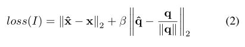

% Pose estimation/regress with learning methods.
% MiaoDX 缪东旭 MiaoDX@tju.edu.cn
% Sep, 2017

# What & Why

***
## What is pose estimation

* pose estimation
* relative pose estimation
* pose regress(-ion)
* pose relocalization

Given images, try to get their relative/absolute pose

-> potentially relocate the agent.

Most people are doing the `estimation` work, in large scale:

* easy to compare with others' results (papers), on existing datasets
* the `relocate` process (what our 6-dof robot is doing) is one of the applications 
* robots with high movement precision are not widely used/deployed (yet), and most of them are aiming at **navigation**
* widely used robots (Amazon Warehouse Robots, for example) **can** have simpler solution -- guide by line (?), for example


***
## Methods

* Classical
    - place recognition: landmarks
    - metric localisation: feature-based mostly

NOTE: we will not distinguish `classical` and `feature-based` methods from now on.

* Learning based
    - it is getting more and more attention these days


***
## Why

Why we need learning when we already have classical methods (feature-based), which are still `state-of-the-art`?

> If all you have is a hammer, everything looks like a nail -- Maslow's hammer

"These methods require a **3D model** with a **large database** of features and **efficient retrieval** methods. They are **expensive** to compute, often do **not scale** well, and are often **not robust** to changing environmental conditions"

--- Geometric loss functions for camera pose regression with deep learning

In contrast, the learning based methods **can be** much more **smaller**, and much more **quicker**. And there is a considerable gap between these two methods, leaving place for the academic world.


***
{#fig:efficiency width=75%}

" For comparison matching to the convnet nearest neighbour is also shown. This requires storing feature vectors for each training frame, then perform a linear search to find the nearest neighbour for a given test frame."

-- PoseNet: A Convolutional Network for Real-Time 6-DOF Camera Relocalization

# Some papers

***
PoseNet: A Convolutional Network for Real-Time 6-DOF Camera Relocalization

```
@inproceedings{kendall2015posenet,
  title={Posenet: A convolutional network for real-time 6-dof camera relocalization},
  author={Kendall, Alex and Grimes, Matthew and Cipolla, Roberto},
  booktitle={Proceedings of the IEEE international conference on computer vision},
  pages={2938--2946},
  year={2015}
}
```


***
## PoseNet in short

* the first paper issue 6-dof camera pose with deep learning
    - $p=[x,q]$
    - $x$: 3D camera position
    - $q$: quaternion $q$ for $R$, for easy training; re-normalize and covert back to $R$ when testing
* consider $q$, $t$ separately, $\beta$ counts for the scale difference
    
    {#fig:loss_f width=75%}

***

{#fig:loss_f width=75%}

Note on $q$ and the `re-normalize` mentioned before:

* The set of rotations lives on the **unit sphere** in **quaternion space**. 
* However the Euclidean loss function **makes no effort to keep** $q$ on the unit sphere. 
* We find, however, that during training, $q$ becomes close enough to $\hat{q}$ such that the distinction between **spherical distance** and **Euclidean distance** becomes **insignificant**. 
* For simplicity, and to **avoid hampering** (妨碍) the optimization with unnecessary constraints, we chose to **omit the spherical constraint**.


***
{#fig:loss_f width=75%}

Note on $\beta$:

Combine the $x$ and $q$ together with $\beta$, since they are related to each other intuitively, and latter experiments trained separately showed bad results.

" We found $\beta$ to be greater for outdoor scenes as position errors tended to be relatively greater. <br> Following this intuition we fine tuned $\beta$ using grid search. <br> For the indoor scenes it was between 120 to 750 and outdoor scenes between 250 to 2000."

Intuitively, it will benefit if we consider some geometric information. (Which is true, by the way)

***
## Implementation


***
{#fig:googlenet width=95%}

GoogLeNet: 22-layer CNN with six *inception modules* and two additional intermediate classifiers which are discarded at test time. (not so familiar here)

Proposed modified version:

* All three softmax classifiers -> affine regressors
* Insert FC before the final regressor of feature size 2048. This was to form a **localization feature vector** which **may** then be explored for generalisation
* Normallize $q$ when testing

Image -> rescaled with smallest dimension=256 -> crop to 224*224.

Train on random crop, test with center crop and 128 uniformly spaced crops (not so sure whether it is the original image or not) and average. 5ms->95ms.

***
## Dataset & evaluation

{#fig:dataset width=75%}

Use camera pose from SfM as GT (training labels).

***

{#fig:eval_1 width=75%}

***

{#fig:eval_2 width=75%}

The **competitive** is somewhat controversial ..

***
## The robustness of proposed method

***
Robustness (1)
{#fig:robust_1 width=75%}

* motion blur
* dusk & night lighting


***
Robustness (2)
{#fig:robust_2 width=75%}


* weather condition
* other objects showed up
* unknown camera intrinsics

***
Robustness (3)
{#fig:robust_spacing width=75%}

Robustness against training image spacing

***
## Transfer learning (the training method)

* Starting our pose training from a network **pretrained on** giant datasets such as *ImageNet* and *Places*
*  We demonstrate transfer learning **from classification to the qualitatively different task** of pose regression.
*  It is **not** immediately **obvious** that a network trained to output **pose-invariant** classification **labels** would be suitable as a starting point for a pose regressor. 
*  We find, however, that this is not a problem in practice.
    -  RESULTS shows that it is okay, so `we` seek explanation -.-
*  A **possible explanation** is that, in order for its output to be invariant to pose, the classifier network must keep track of pose, to better factor its effects away from identity cues. 
*  This would agree with our own findings that a network trained to output **position and orientation outperforms** a network trained to output **only position**.
    -  The $\beta$ mentioned before

***
## Visualising features

{#fig:feature_visualing width=75%}

" The saliency map, is the **magnitude** of the **gradient of the loss function** with respect to the pixel **intensities**. <br> This uses the sensitivity of the pose with respect to the pixels as an indicator of how important the convnet considers different parts of the image."

* strongest response is observed from **higher-level** features such as windows and
spires. 
* a more surprising result is that PoseNet is also very sensitive to **large textureless patches** such as road, grass and sky.
    - which, by the way, will fail feature-based methods
* has an attenuated (使减弱) response to people and other noisy objects, effectively masking them

***
## Viewing the internal representation

{#fig:vector_visualizing width=75%}

apply t-SNE to the feature vectors computed from a sequence of video frames taken by a pedestrian.

As these figures show:

* the feature vectors are a function that smoothly varies with, and is largely one-to-one with, pose.
    - **pose mainfold**
*  This *pose manifold* can be observed not only on networks trained on **other scenes**, but also networks trained on **classification** image sets without pose labels.
    -  classification convnets preserve pose information up to the final layer, regardless of whether it’s expressed in the output
*  This demonstrates that the feature vector that is produced from regression is **able to generalize** to other tasks in the same way as classification convnets.
    - Proposed methods can have potential benefit to others.

***
## Conclusion

* first application of deep CNN to end-to-end 6-DOF camera pose localization
* sidestep the need for millions of training images by use of transfer learning from networks trained as classifiers
    - such networks (classifiers) preserve ample pose information in their feature vectors, despite being trained to produce pose-invariant outputs

In the future:

* geometric information
* explore probabilistic extensions


***
{#fig:poster width=75%}

***
{#fig: width=75%}