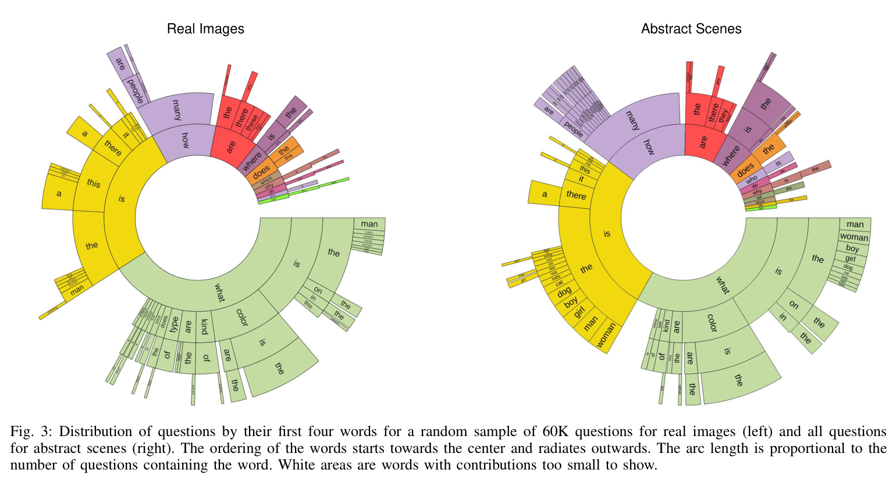
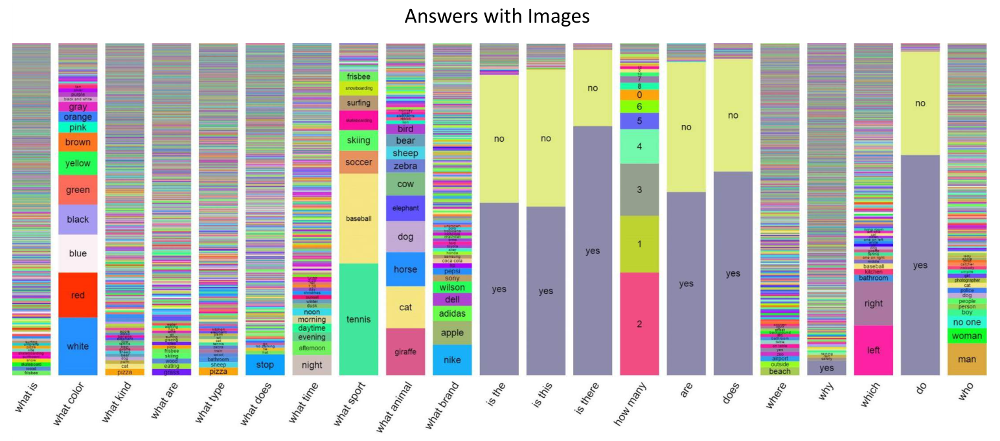
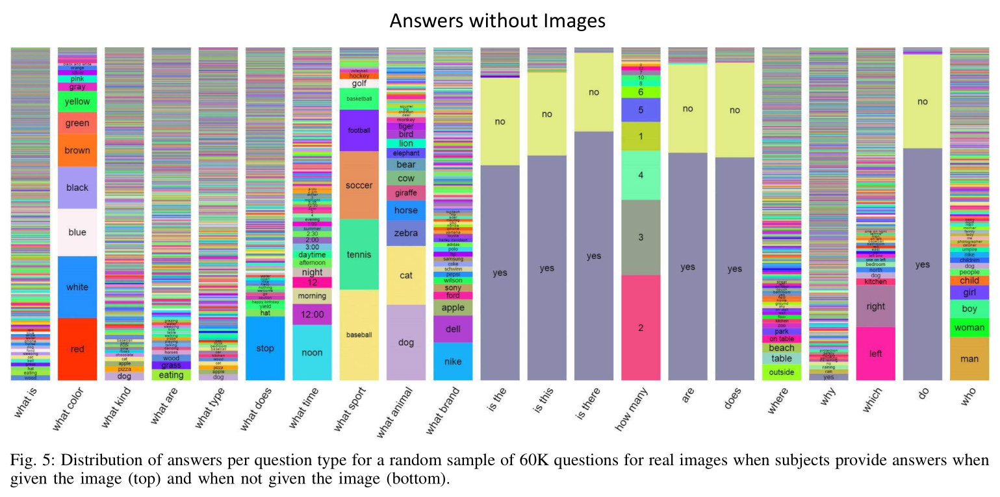
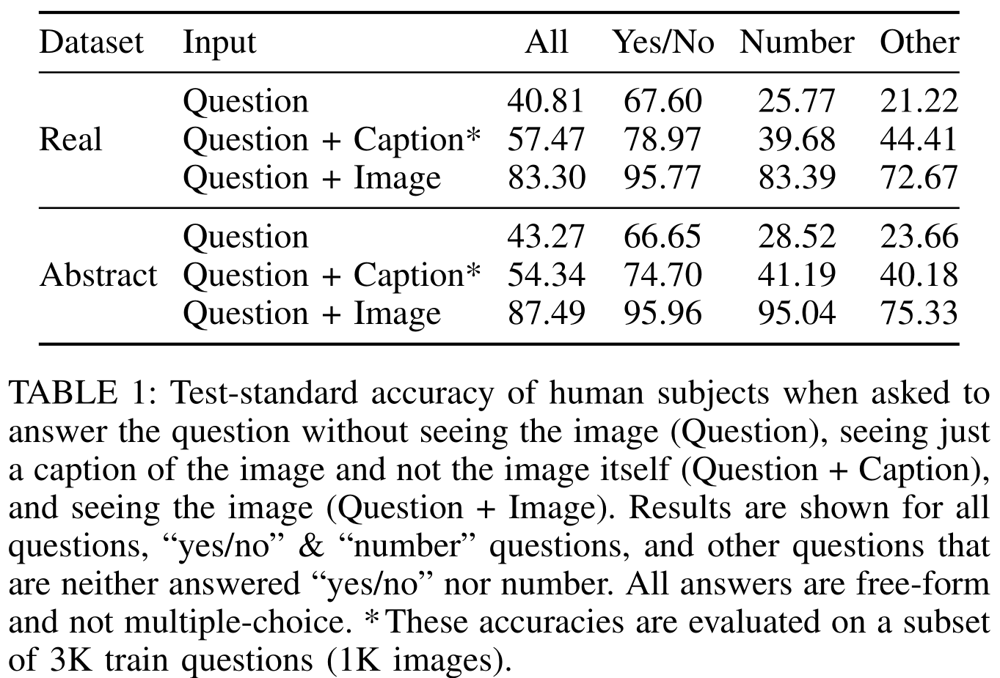
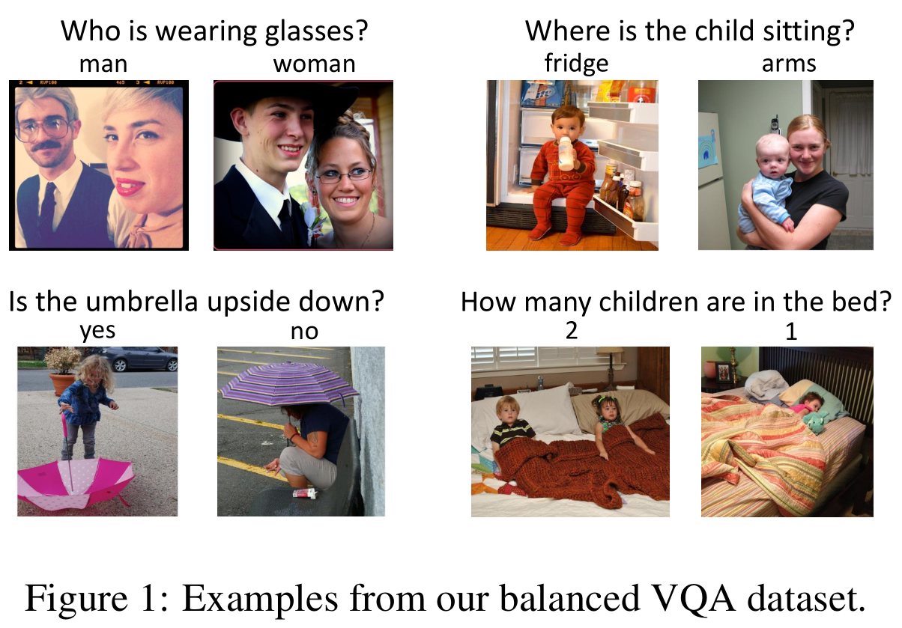
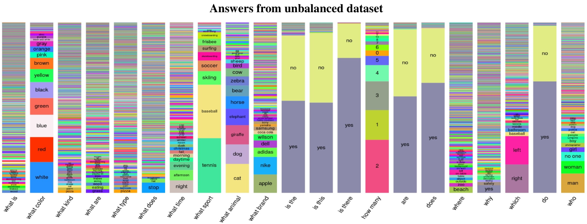
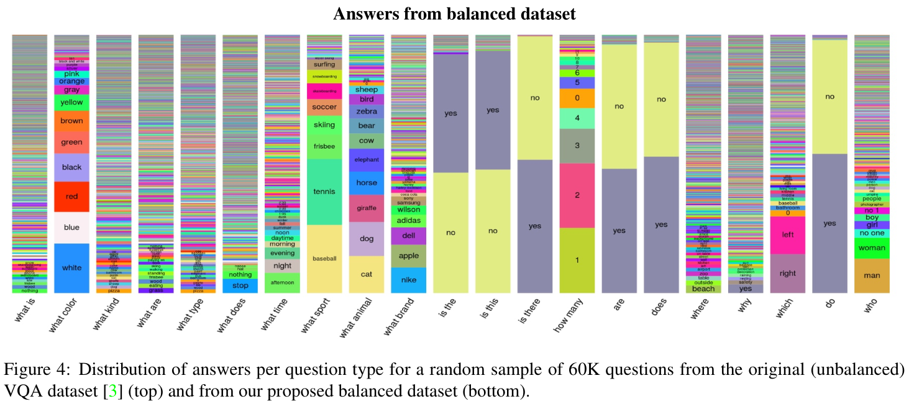
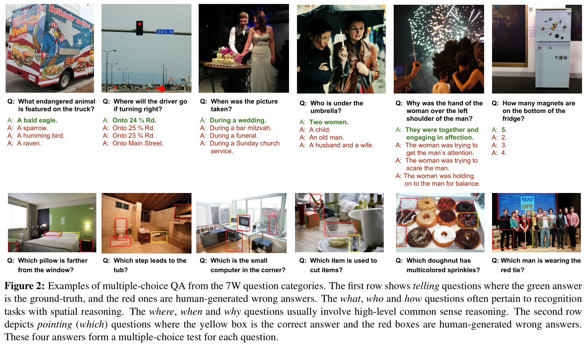

% VisualQA, Brief Introduction
% MiaoDX 缪东旭 MiaoDX@hotmail.com
% July, 2017

# What & Why

***
## What

Given image and question pair, answer the question with the image.

Answer without question or question is **NOT** VisualQA.

***
## Why

* A better Turing Test, "AI-complete task"
* Combination of NLP and CV
* New research area

# Datasets

* VisualQA
* Microsoft COCO
* Visual Genome

***
## Microsoft COCO

{width=25%}

Image from [http://mscoco.org/](http://mscoco.org/), July 12, 2017

Note that they are releasing progressively.

Paper: [Microsoft COCO: Common Objects in Context](https://arxiv.org/abs/1405.0312)

*** 

### Dataset Features:

* Common Object Categories (91 in the paper, 80 now released)
* Non-iconic Images
* Full segmented instances

***

{width=40%}

. . .

{width=40%}

. . .

{width=40%}

***

### Ways to collect the dataset:

* Queries for pairs of objects in conjunction (people + chair)
* Each image was labeled as containing particular object categories using
a hierarchical labeling approach
* For each category found, the individual instances were labeled, verified,
and finally segmented. 

. . .

{width=50%}

***
One more example:

{width=35%}
{width=35%}
{width=35%}
{width=35%}

***
### Research Papers

MSCOCO Challenges: Detection (BBOX & SEGM), Captions, Keypoint

{width=40%}
{width=40%}

***
## VisualQA Dataset

Version 1: COCO + Abstract Scene

Version 2: V1 + Balanced QA

***
## VisualQA V1

{width=50%}

Free-form, open-ended, natural-language question.

Paper: [VQA: Visual Question Answering](http://arxiv.org/pdf/1505.00468v6.pdf)

***
### Dataset Collection

* Real Images: 123,287 training and validation images + 81,434 test images from MSCOCO
* Abstract Scenes: 50K scenes

. . .

When collecting questions:

“ We have built a smart robot. ...  Ask a question about this scene that this smart robot probably can not answer, but any human can easily answer while looking at the scene in the image.

***
Answers:

* open-ended
    - gather 10 answers for each question from unique workers
* multiple-choice
    - 18 candidate answers are created for each question
    - Include:
        + Correct
        + Plausible (answer questions without the image)
        + Popular ( 10 most popular answers: "yes", "no", "2", "1", "white", "3", "red", "blue", "4", "green" for real images. To avoid the algorithm learning given questions are “yes or no” questions because "yes" and "no" is present)
        + Random (include random answers until 18 candidate)

***
### Dataset Analysis

{width=70%}

***

{width=45%}
{width=45%}

Is the image necessary (I)?

***

{width=70%}

***
### Dataset **Bias**

**'Yes/No' and 'Number' Answers**. 

. . .

Many questions are answered using either "yes" or "no" (or sometimes "maybe") 38.37% and 40.66% of the questions on real images and abstract scenes respectively. 

. . .

Among these 'yes/no' questions, there is a bias towards "yes" – 58.83% and 55.86% of 'yes/no' answers are "yes" for real images and abstract scenes.

. . .

Question types such as "How many..." are answered using numbers – 12.31% and 14.48% of the questions on real images and abstract scenes are 'number' questions. 

. . .

"2" is the most popular answer among the 'number' questions, making up
26.04% of the 'number' answers for real images and 39.85% for abstract scenes.

***
## VisualQA V2

Paper: [Making the V in VQA Matter: Elevating the Role of Image Understanding in Visual Question Answering ](https://arxiv.org/pdf/1612.00837.pdf)

. . .

"But recent works have pointed out that language also provides a strong prior that can result in good superficial performance, without the underlying
models truly understanding the visual content.

. . .

"For instance, in the VQA dataset, the most common sport answer "tennis" is the correct answer for 41% of the questions starting with "What sport is", and "2" is the correct answer for 39% of the questions starting with "How many". 

. . .

"Moreover, Zhang et al. points out a particular 'visual priming bias' in the VQA dataset – specifically, subjects saw an image while asking questions about it. Thus, people only ask the question "Is there a clock tower in the picture?" on images actually containing clock towers. As one particularly perverse example – for questions in the VQA dataset starting with the n-gram "Do you see a ...", blindly answering “yes” without reading the rest of
the question or looking at the associated image results in a VQA accuracy of 87%!

***
So, there is VisualQA v2.0, 

" ... it identifies an image that is **similar to** the original image, but it believes has a **different answer** to the **same question**.

{width=70%}

***
### Dataset Analysis

{width=45%}
{width=45%}

VQA distribution of answers per question type of VisualQA v2.0

***
## Visual7W

Paper: [Visual7W: Grounded Question Answering in Images](https://arxiv.org/abs/1511.03416)

We establish a semantic link between textual descriptions and image regions by object-level grounding.

{width=70%}

7W:

* Telling questions:
    - what, where, when, who, why, how
    - Multi-choice

* Pointing questions:
    - which

# Baseline and state-of-the art methods

# The Cost of Dataset Collecting

We know it cost a lot to collect large dataset,  but how much dose it cost (approximately)?

***

{width=50%}

* Categories labeling
    - To ensure high recall, 8 workers were asked to label each image
    - This stage took ~20k worker hours to complete
* Instance Spotting
    - Each image was labeled by 8 workers for a total of ~10k worker hours
* Instance Segmentation
    - Segmenting 2,500,000 object instances is an extremely time consuming task requiring over 22 worker hours per 1,000 segmentations
    - To minimize cost we only had a single worker segment each instance

***

20+10+2.5*22 = 85

. . .

"Utilizing over 70,000 worker hours, a vast collection of object instances was gathered, annotated and organized to drive the advancement of object detection and segmentation algorithms.

. . .

70,000/24/365 = 7.99 YEAR :)