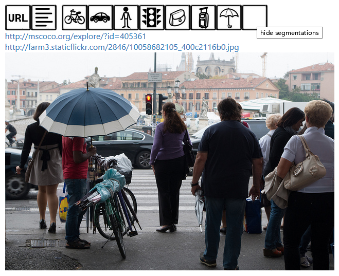

% VisualQA, Brief Introduction
% MiaoDX 缪东旭 MiaoDX@hotmail.com
% July, 2017

# What & Why

## What

Given image and question pair, answer the question with the image.

Answer without question or question is **NOT** VisualQA.

## Why

* A better Turing Test, "AI-complete task"
* Combination of NLP and CV
* New research area

# Datasets

* VisualQA
* Microsoft COCO
* Visual Genome

## Microsoft COCO

[http://mscoco.org/](http://mscoco.org/)

{width=50%}

Image from [http://mscoco.org/](http://mscoco.org/), July 12, 2017

Note that they are releasing progressively.

Paper: [Microsoft COCO: Common Objects in Context](https://arxiv.org/abs/1405.0312)

*** 

### Dataset Features:

* Common Object Categories (91 in the paper, 80 now released)
* Non-iconic Images
* Full segmented instances

***

{width=40%}

{width=40%}

{width=40%}

***

### Ways to collect the dataset:

* Queries for pairs of objects in conjunction (people + chair)
* Each image was labeled as containing particular object categories using
a hierarchical labeling approach
* For each category found, the individual instances were labeled, verified,
and finally segmented. 

{width=50%}

***

One more example:

{width=40%}
{width=40%}
{width=40%}
{width=40%}

### Research Papers

Detection (BBOX & SEGM), Captions, Keypoint

{width=50%}

{width=70%}

## VisualQA Dataset

Version 1: COCO + Abstract Scene
Version 2: V1 + Balanced QA

## VisualQA V1

{width=50%}

Paper: [VQA: Visual Question Answering](http://arxiv.org/pdf/1505.00468v6.pdf)

# The Cost of Dataset Collecting

We know it cost a lot to collect large dataset, but how much dose it cost(approximately)?

The MSCOCO dataset:

