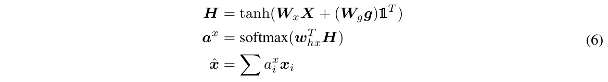

# Baseline and state-of-the art algorithms

***
## VQA:
Paper: [VQA: Visual Question Answering](http://arxiv.org/pdf/1505.00468v6.pdf)

" ... we develop a 2-channel vision (image) + language (question) model that culminates with a softmax over K possible outputs.

K = 1000 most frequent answers, covers **82.67%** of the train+val answers.

### Image Channel

* I
    - The activations from the last hidden layer of VGGNet are used as 4096-dim image embedding
* norm I
    -  $l_2$ normalized activations from the last hidden layer of VGGNet

### Question Channel

* Bag-of-Words Questions (BoW Q)
    -  top 1,000 words in the questions +  top 10 first, second, and third words of the questions (strong correlation between the words that start a question and the answer) = 1,030

* LSTM Q
    - An LSTM with one hidden layer is used to obtain 1024-dim embedding for the question
    - Each question word is encoded with 300-dim embedding by a fully-connected layer + tanh non-linearity which is then fed to the LSTM

* deeper LSTM Q
    - An LSTM with two hidden layers is used to obtain 2048-dim embedding for the question, followed by a fully-connected layer + tanh non-linearity to transform 2048-dim embedding to 1024-dim

{width=70%}

{width=70%}

### Multi-Layer Perceptron (MLP)

* BoW Q + I
    - simply concatenate the BoW Q and I embeddings

* LSTM Q + I, deeper LSTM Q + norm I
    - Image embedding -> 1024 dim (match LSTM for question)
    - Image embedding * question embedding (element-wise multiplication)

***
## Visual7W

Paper: [Visual7W: Grounded Question Answering in Images](https://arxiv.org/abs/1511.03416)

{width=70%}

" The model first reads the image $v_0$ and all the question tokens $v_q1$ , $v_q2$ ,..., $v_qm$ until reaching the question mark (i.e., end token of the question sequence). 

When training for telling QA, we continue to feed the ground-truth answer tokens v a 1 , v a 2 ,...,v a n into the model. 

For pointing QA, we compute the log-likelihood of an candidate region by  a dot product between its transformed visual feature (fc7) and the last LSTM hidden state.

***

{width=70%}

LSTM (Question) > Human (Question) => 

" Human subjects are not trained before answering the questions; however, the LSTM model manages to learn the priors of answers from the training set.

SO, could it be "if do not know, choose C"? :)

{width=70%}

***
## HieCoAttenVQA

[Hierarchical Question-Image Co-Attention for Visual Question Answering](https://arxiv.org/abs/1606.00061)

"where to look" or visual attention

"what words to listen to" or question attention

* Co-Attention
    - jointly reasons about visual attention and question attention

* Question-Hierarchy
    -  (a) word level
        +  words to a vector
    -  (b) phrase level
        +  1d CNN: word representations with temporal filters -> pooling them into a single phrase level representation
    -  (c) question level
        +  RNN: encode the entire question

***
{width=70%}

***
{width=70%}

{width=70%}

***
{width=70%}

Note the three hierarchy.

***
{width=70%}

***
{width=70%}

**
## MCB

Paper: [Multimodal Compact Bilinear Pooling for Visual Question Answering and Visual Grounding](https://arxiv.org/abs/1606.01847)

