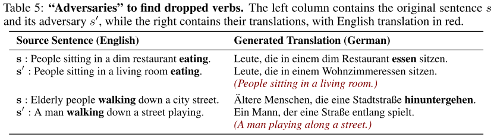

% Generating Natural Adversarial Examples
% MiaoDX   mioadx@tju.edu.cn
% May, 2018

# What & Why

Adversarial example:

Inputs with minor perturbations that result in substantially different model predictions

***
## Why it matters

* One way to evaluate the robustness of DL models
* Adoption of DL models in various security-sensitive applications
* Train models by including such adversaries can **(/may)** provide machine learning models with additional regularization benefit

***
## Some limitations of Adversaries

. . .

These malicious perturbations are:

* often unnatural
* not semantically meaningful (input/semantic space)
* not applicable to complicated domains such as language

***
This paper proposes one **framework** to generate **natural and legible** adversarial examples that lie on the **data manifold**, by searching in **semantic space** of dense and continuous data representation, instead of searching in the input data space directly.

. . .

Generated adversaries are natural, legible to humans, and useful in evaluating and analyzing **black-box** classifiers.

***

{width=75%}

FGSM, Fast Gradient Sign Method

Ian Goodfellow, Jonathon Shlens, and Christian Szegedy. Explaining and harnessing adversarial examples. In International Conference on Learning Representations (ICLR), 2015.

# Framework

***
## Goal

. . .

Given

* Black-box classifier $f$
* A corpus of unlabeled data $X$

. . .

Goal 

* Generate adversarial example $x^*$ for a given data instance $x$ that results in a different prediction, i.e. $f(x^*) \neq f(x)$.

. . .

And

* Instance $x$ may not be in $X$
* But comes from the same **underlying distribution $P_x$**

***

We want $x^*$ to be the nearest such instance to $x$ in terms of the manifold that defines the data distribution $P_x$, instead of in the original data representation.

By **searching for samples in** the **latent** low-dimensional $z$ space and mapping them to $x$ space to identify the adversaries, we encourage these adversaries to be **valid** (legible for images, and grammatical for sentences) and **semantically** close to the original input.

***

SO, we need powerful generative models to learn a mapping **from** the latent low-dimensional representation **to** the distribution $P_x$, **which we estimate using samples in $X$** -- GAN

***
## Architecture

***

* **First train** a (W)GAN on corpus $X$, which provides a generator $G_\theta$ that maps random dense vectors $z \in \mathbb{R}_d$ to samples $x$ from the domain of $X$
* **Separately train** a matching inverter $I_γ$ to map data instances to corresponding dense representations
* We minimize the **reconstruction error** of $x$, and the **divergence**
between sampled $z$ and $I_γ(G_θ(z))$ to encourage the latent space to be normally distributed
* As for the divergence $L$, we use $L2$ distance with $λ=.1$ for images and Jensen-Shannon distance with $λ=1$ for text data

***
Using **these learned functions**, we define the natural adversarial example $x^*$ as the following:

***
## Search Algorithms

* Iterative stochastic search, perturbations $\tilde z$ are randomly sampled ($N$ samples for each iteration)
* Coarse-to-fine strategy, hybrid shrinking search, first search for adversaries in a wide search range, and recursively tighten the upper bound of the search range with denser sampling in bisections

***
Utilize the inverter to obtain the latent vector $z'=I_γ(x)$ of $x$, and feed perturbations $\tilde z$ in the neighborhood of $z'$ to the generator to generate natural samples $\tilde x = G_\theta(\tilde z)$

Both these search algorithms are **sample-based** and **applicable to black-box classifiers** with no **need** of access to their gradients. Further, they are **guaranteed** to find an adversary, i.e. one that upper bounds the optimal adversary.

# Illustrative Examples

***
## Generating Image Adversaries

***
### MNIST

{width=75%}

* Generator consisting of transposed convolutional layers; critic consisting of convolutional layers; the inverter with fully connected layers on top of the critic’s last hidden layer
* Classifier ($f$ in Figure 3): Random Forests and LeNet
* $z \in \mathbb{R}^{64}$

***
{width=75%}

* Our adversaries are quite similar to the original inputs in overall style and shape
* compared to RF, LeNet requires more substantial changes to the inputs to be fooled -> **in other words**, RF is less robust than LeNet in classification

***
### Church vs Tower (LSUN dataset)

* Generator and critic are deep residual networks
* Classifier: MLP classifier trained on these two classes
* $z \in \mathbb{R}^{64}$

***
## Generating Text Adversaries

* Challenging task due to the discrete nature of text
* Add imperceptible noise is impossible
* Most actual changes to x may not result in grammatical text
* Performs perturbations in the **continuous space $z$**, that has been trained to produce semantically and syntactically coherent sentences automatically

***
[HOWTO]

* Adversarially regularized autoencoder (ARAE) encodes a sentence with an LSTM encoder into continuous code and then performs adversarial training on these codes to capture the data distribution
* $z \in \mathbb{R}^{100}$
* Train framework on the Stanford Natural Language Inference (SNLI) data of 570k labeled human-written English sentence pairs

***
### Textural Entailment

{width=75%}

Evaluate common-sense reasoning for language.

Classify a pair of sentences *premise* and a *hypothesis*, into three categories depending on whether the hypothesis is *entailed by* the premise, *contradicts* the premise, or is *neutral to* it.

Adversary: we use our approach to generate adversaries by perturbing the hypothesis to deceive classifiers, keeping the premise unchanged.

Again, better models require much more substantial changes to the sentences to be fooled.

***
### Machine translation

Adversary: we now define a probing function that passes only if the perturbed English sentence $s'$ contains both the verbs, but the translation only has one of them.

# Evaluate model robustness

Proposed method can be utilized to compare and evaluate the robustness of black-box models even without labeled data.

Primary intuition: more accurate classifiers often require more substantial changes to the instance to change their predictions, as shown before

***
HOW TO quantify the extent of change for an adversary:

* use the distance of the adversary in the latent space, i.e. $\Delta z = ||z^*-z'||$
* consider the set of adversaries generated for each instance against a group of classifiers, and count how many times the adversary of each classifier has the highest $\Delta z$

***

For both the tasks, we observe that more accurate classifiers require larger changes to the inputs (by both measures), indicating that generating such adversaries, even for unlabeled data, can evaluate the accuracy of black-box classifiers

*** 

{width=75%}

Study the effect of changing hyper-parameters of models on the results (focusing on MNIST).

Given this strong correlation, we are confident that our framework for generating natural adversaries can be useful for automatically evaluating black-box classifiers, even in the absence of labeled data.

***
## Human Evaluation

* (1) how natural or legible each generated adversary is
* (2) which of the two adversaries is closer to the original instance

. . .

# Discussion

* In our practice, we observe that we need to **carefully** balance the capacities of the generator, the critic, and the inverter that we introduced, to avoid situations such as model collapse
* The accuracy of our inverter mapping the input to its corresponding dense vector in latent space is also important for searching adversaries in the right neighborhood.
* **implicit assumption** in this work that the generated samples are within the same class if the added perturbations are small enough, and the generated samples look as if they belong to different classes when the perturbations are large -- THIS IS A STRONG ASSUMPTION

# Comments

* Train GAN, inverter separately
* Not (so) suitable as augmentation data

# Comment on Open Review

[https://openreview.net/forum?id=H1BLjgZCb](https://openreview.net/forum?id=H1BLjgZCb)

