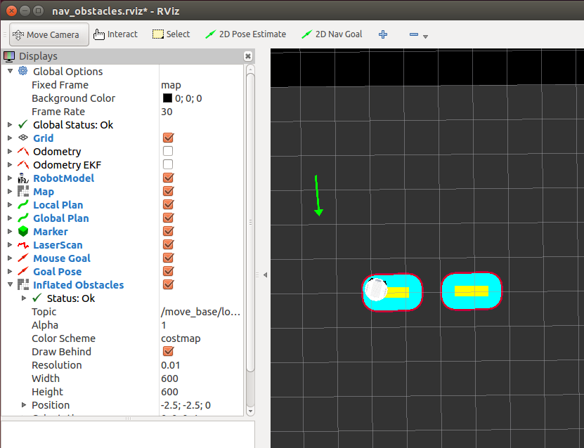

ros by example vol 1 indigo.

## 4.12 Networking Between a Robot and a Desktop Computer

Networking and communicating is rather important for a distributed system.

### 4.12.1 Time synchronization

`sudo apt-get install chrony` That easy?

### 4.12.2 ROS Networking using Zeroconf

The concept is really interesting, since we can use `nicknames` for communication, wonder whether it can be used in programs.

### 4.12.6 Running Nodes on both Machines

`roscore &` to make it run in background.

### 7.2.3 The ROS Base Controller

> some robots like the TurtleBot, uses the  robot_pose_ekf package to combine wheel odometry and gyro data to get a more accurate estimate of the robot's position and orientation. 

It is always prior to add extra constraints on the measurements of odometry.

### 7.3.2

> Some robots like the TurtleBot require the movement command to be continually published or the robot will stop: a nice safety feature.

## 7.4 Calibrating Your Robot's Odometry

We should calibrate our odometry at the very first.

What if, as in general, the base move not at constant speed, but with a speed up phase?

### 7.6.4 Timed Out and Back using a Real Robot

Odometry EKF. In real robot, odometry also comes from encoders(+gyro).


### 7.9.4 The Trouble with Dead Reckoning

The processing of navigating a course while relying only on internal motion data and without reference to external landmarks is referred to as dead reckoning.

### 8.1.2 Configuration Parameters for Path Planning

differential and holonomic robot

### 8.2.5 Setting Manual Goals with Obstacles Present

An interesting but dangerous thing happed when I set one manual goal that is just inner the border, the robot run into the border and abort. But when I set other legal point as shown below, the planner still failed to generate a solution.

``` vi
[ERROR] [1514360144.629902493]: Aborting because a valid plan could not be found. Even after executing all recovery behaviors
```



So, maybe we should take into consideration of this kind of situations, as it's ridiculous to avoid doing anything at all just to keep in false safety.

## 8.4 Map Building using the  gmapping Package

> A map in ROS is simply a bitmap image representing an occupancy grid where white pixels indicate free space, black pixels represent obstacles, and gray pixels stand for "unknown".

When we do SLAM with ROS, there will be the conversion of specific map into bitmap for ROS.

### 8.5.2 Using  amcl with a Real Robot

> When amcl first starts up, you have to give it the initial pose (position and orientation) of the robot as this is something  amcl cannot figure out on its own.

So, there should be a rotate a circle startup.

> The Pose Array topic is set to the  /particlecloud topic which is the default topic on which  amcl publishes its pose estimates for the robot. (See the amcl Wiki page for details.) As the robot moves about the environment, this cloud should shrink in size as additional scan data allows  amcl to refine its estimate of the robot's position and orientation.

Not so sure of its mechanism, but it should be one of the probability inference method.

### 8.5.3 Fully Autonomous Navigation

> For instance, if we wanted to create a "Patrol Bot" application, we might select a series of locations for the robot to visit, then set the program running and walk away.

Patrol Bot, a good idea for making the robot just running.

> endurance test

Run a looong time to test the robot, nice idea.

For the simulation, after running, message showed up that:

``` vi
[INFO] [WallTime: 1514364657.395972] *** Click the 2D Pose Estimate button in RViz to set the robot's initial pose...

```

~~However, even though I set it to be totally wrong, the robot can still run without too much affect in the x-y of final pose, however, the rotation is totally wrong due to our disturbance. I have no idea whether it hurt a lot when in the real world scenario.~~ It seems that we can set the robot's position and rotation at the very beginning, at first, I thought it was adjusting pose to the existing robot. But it can be a little confusing combined with the previous `you have to give it the initial pose (position and orientation) of the robot as this is something  amcl cannot figure out on its own.` NOTE: Maybe in real world, we should take consideration into it, since we can not just adjusting robot's pose by do a click, we should probably assign a `perfect` pose to existing robot, leave it to when we do have a running robot.

> Rather than force the robot to rotate to a particular orientation at each location, we can set the  yaw_goal_tolerance parameter to 360 degrees (6.28 radians) which means that once the robot gets to a goal location, the base local planner will be happy with whatever orientation the robot has as it arrives. 

Good guidance.

###


unable to reach anywhere if no possible path planning exists.

## 10.6 The ros2opencv2.py Utility

The described process can just be used as detection and tracking demo.

### 10.8.3 Tracking Keypoints using Optical Flow

The LKT tracker.

### 10.8.4 Building a Better Face Tracker

Detection then tracking, we will use it latter.

### 10.8.5 Dynamically Adding and Dropping Keypoints

> We can easily add new keypoints and drop bad ones during the tracking process. To add keypoints, we run  goodFeaturesToTrack() every once in awhile over the region we are tracking. To drop keypoints, we can run a simple statistical clustering test on the collection of keypoints and remove the outliers.

The `statistical clustering` can be very useful when the tracking object's appearance is distinguishable.

### 10.8.6 Color Blob Tracking (CamShift)

Color prior can be used when the target is dominate by one color or easily distinguish from the background.

> Blurring helps wash out some of the color noise in typical video images. Working in HSV space is a common practice when processing color images. 

# 11. COMBINING VISION AND BASE CONTROL

## 11.1 A Note about Camera Coordinate Axes

The camera coordinate is what we want, Z pointing to the image plane, x to right and y downward.

> Note that this frame differs from the one typically attached to a mobile base which, as we saw earlier, has the z-axis pointing upward, the x-axis pointing forward, and the y-axis point to the left. 

## 11.2 Object Tracker

> If the camera is mounted on a mobile robot, we can use the  x_offset coordinate of the /roi to keep the object centered in the field of view by rotating the robot to compensate for the offset

`compensate for the offset`, good description.

## 11.3 Object Follower

If we do not have the depth info, we can still perform some depth measure with some tricks. For example, we can use the percentage of area of object in the image as an indication, the larger the closer, with some filtering, this can be fast and pretty accurate.


# Conclusion

Many of pages are skipped for a quick read through, nice book.

The codes in this book is very impressive, very suitable for our current project, the DJI ICRA Robomaster Challenge for an autonomous robot competition, I will duplicate the tracking codes and make it workable with newer version of OpenCV(2) in recent days.